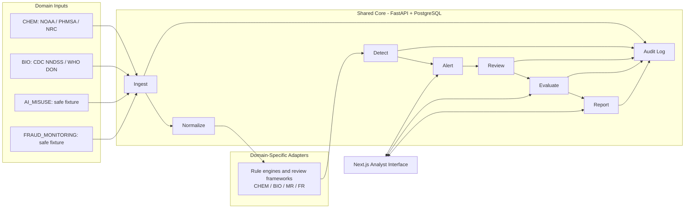

# CBRN-E Intelligence Lab

CBRN-E Intelligence Lab is a real-data risk signal platform under development. It ingests approved public or user-provided datasets, normalizes source records, runs explainable detection rules, and creates evidence-linked alerts for analyst review.

CBRN-E is the first operational domain. A controlled fraud fixture experiment demonstrates that the shared event, alert, evaluation, report, and audit workflow can be reused while each domain supplies its own rules and review controls.

## Current Build Status

Incident monitoring foundation now includes:

- PostgreSQL-backed application model and migration.
- FastAPI endpoints for sources, ingestion, normalized events, detection runs, alerts, analyst reviews, notifications, and response-doctrine review.
- Next.js analyst interface for source registration, dataset upload, and alert review.
- Direct NOAA IncidentNews public-domain CSV connector for selected response-support incidents.
- PHMSA export importer with report-level deduplication and unit-aware release scoring.
- NRC annual workbook importer with report-level numeric consequence scoring and NRC/PHMSA correlation review alerts.
- AI Misuse Risk Assessment Module using public-safe abstract evaluation records and separate internal review routing.
- Evaluation and backtesting workspace linking controlled or analyst-labeled benchmark cases to versioned detection runs and alert evidence.
- Biological monitoring work in local development using bounded WHO Disease Outbreak News and CDC NNDSS official public-data synchronization.
- Source-cited report generation from analyst-reviewed alerts, with deterministic JSON and printable HTML export.
- `FRAUD_MONITORING_V0.1` portability experiment using abstract synthetic records and separate `FR0` to `FR3` review routing.

This build does **not** confirm malicious intent and does **not** automatically notify external agencies. Automated detections are review priorities.
Reports do **not** add narrative conclusions or call an AI service; they preserve recorded evidence, review disposition, and stated limits.

## Architecture



## Stack

| Layer | Technology |
|---|---|
| API | Python, FastAPI, Pydantic |
| Data access | SQLAlchemy, Alembic |
| Operational database | PostgreSQL |
| Frontend | Next.js, TypeScript, Tailwind CSS |
| Local service orchestration | Docker Compose |
| Testing | Pytest, FastAPI TestClient |

## Run Locally

Prerequisites: Python 3.12+, `uv`, Node.js, and PostgreSQL or Docker.

With a local PostgreSQL service, create a database and use the local socket connection:

```bash
cp .env.example .env
/opt/homebrew/opt/postgresql@16/bin/createdb cbrne_lab
# Set DATABASE_URL=postgresql+psycopg:///cbrne_lab in .env
cd backend
uv sync --extra dev
uv run alembic upgrade head
uv run uvicorn app.main:app --reload --port 8000
```

Docker Compose remains an alternative where Docker is available:

```bash
docker compose up -d postgres
# Keep the DATABASE_URL value provided in .env.example
```

In another terminal:

```bash
cd frontend
npm install
npm run dev
```

Open `http://localhost:3000`. The API health endpoint is `http://localhost:8000/health`.

## Source Handling

Stage 0 source candidates are official public data:

| Source | Intended use |
|---|---|
| NOAA IncidentNews Raw Incident Data | First direct public-domain CHEM incident connector |
| PHMSA Hazmat Incident Reports | CHEM/hazmat incident analysis and baselines |
| National Response Center reports | Environmental release event monitoring |
| WHO Disease Outbreak News API | Official BIO report context through bounded API synchronization |
| CDC NNDSS Weekly Data | Weekly provisional BIO surveillance review indicators |

Raw data files are local-only and excluded from git. Each ingest records source metadata, file hash, mapping version, and limitations. NOAA IncidentNews contains selected incidents where NOAA supported response; it is not a complete inventory and cannot establish malicious intent.

NOAA commodity names are normalized into a dedicated event field. `CHEM-SUBSTANCE-001` compares that field to the EPA RMP regulated toxic substances in `40 CFR 68.130 Table 1` and creates an analyst review item for a documented match. The signal does not identify malicious intent, regulatory applicability, or verified consequences.

PHMSA delimited-text exports can be imported from the Sources screen. The importer maps `Total Hazmat Fatalities` as a numeric count and converts `Hazmat Injury Indicator` and `Serious Evacuations` values of `Yes` to `TL2` reported-consequence signals for `CHEM-CONSEQUENCE-001`; the indicators are not counts. Stage 2 uses `Report Number` to avoid duplicate incident-level consequence alerts and applies `CHEM-RELEASE-QUANTITY-001` only to quantities reported by PHMSA as standardized liquid gallons (`LGA`). `GCF` and `SLB` data remain preserved without conversion.

NRC annual XLSX workbooks are imported by joining the official `INCIDENT_COMMONS`, `INCIDENT_DETAILS`, and `MATERIAL_INVOLVED` sheets on `SEQNOS`. Numeric NRC injury and evacuation counts can produce count-based `TL3` review alerts. Multiple NRC material rows do not multiply consequence counts. An NRC/PHMSA match sharing an EPA RMP toxic substance, state, and three-day window creates a linked correlation alert for analyst review, not a confirmed incident match.

The AI Misuse Risk Assessment Module loads a committed synthetic evaluation set made only of
public-safe abstract descriptions. `AI_MISUSE_V0.1` assigns internal misuse review levels
(`MR0` to `MR3`) through visible rules. It does not accept harmful prompts, call a live model, or
route fixture records into emergency, external-notification, or response-doctrine workflows.
Local validation routed all 34 fixture cases to their expected highest misuse-review level, with
zero missed high-priority cases and zero unexpected escalations; this is fixture conformance, not
model safety performance.

The dashboard and default alert queue display the latest detection run so historical calibration runs are not added into current alert totals. Earlier runs remain stored for audit review.

The evaluation workspace measures routing behavior against documented expectations. AI misuse
fixture results are labeled `Fixture routing agreement`; they are not model safety performance.
CHEM reviewed benchmarks require an analyst citation and rationale for selected public-source
records; they do not establish intent or population-wide threat detection rates.

Stage 6 adds `BIO_MONITORING_V0.1` locally. WHO Disease Outbreak News records are retained as
official-report observations. CDC NNDSS rows are limited to a selected reporting week, preserve
source flags, reject a weekly response that reaches the bounded 10,000-row cap, and can create a
`TL1` review indicator only when a numeric current-week count is
above CDC's source-published prior 52-week maximum. CDC counts are provisional and may be revised
or delayed; identical repeated rows are skipped while changed official rows are retained as
linked source revisions. BIO indicators cannot establish cause, intent, attribution, or emergency status, and
notification or response-doctrine actions are disabled for this rule version.

Initial local validation imported 20 bounded WHO DON reports and produced 20 `TL1`
official-report observations. A CDC NNDSS import for MMWR 2026 week 19 retained 8,400 weekly
rows, excluded 7,438 non-scorable or flagged rows from scoring, and produced 15 `TL1`
prior-maximum review indicators from 962 scorable rows. These are local rule outputs, not a
threat prevalence or detection-performance claim. A revision-aware repeat sync of the same
official week classified all 8,400 rows as identical duplicates, retained zero false revisions,
and reproduced the 15-indicator result from the canonical import batch.

Stage 7 adds deterministic source-cited reports. A report can include only alerts with a recorded
analyst review, and it cannot mix CHEM, BIO, AI misuse, and fraud records. Each export preserves source
citations, evidence fields, rule rationale, source limitations, analyst disposition, and a
domain-specific disclosure. JSON download and browser-print output are available; AI-written
summaries and automated delivery remain excluded.

Stage 8 adds `FRAUD_MONITORING_V0.1` as a controlled portability experiment. Its 20 synthetic
cases contain abstract category flags only and route through the separate `FRAUD_REVIEW`
framework. Fraud fixture results cannot open CBRN-E notification or doctrine actions and do not
measure real-world fraud performance. EXP and dedicated RN classification are documented as
deferred expansion decisions because the current public-source and classification support does
not justify event-level claims.

## Threat And Escalation Handling

Alerts use `TL0` through `TL4` handling:

| Level | Meaning |
|---|---|
| `TL0` | Logged observation |
| `TL1` | Monitor |
| `TL2` | Investigate with senior review |
| `TL3` | Escalate for internal notification and external-report assessment |
| `TL4` | Emergency or mandatory-report condition; software workflow must not delay response |

For `TL3` and `TL4`, the platform records possible applicability of `NIMS/ICS`, `NRF`/ESFs, `NCP/NRS`, `BIA`, `NRIA`, or narrowly scoped `NARP` references. It cannot claim a responsible agency activated a plan unless verified evidence is recorded.

## Documentation

- [Architecture](docs/architecture.md)
- [Source Manifest](docs/source-manifest.md)
- [Detection Methodology](docs/detection-methodology.md)
- [Safety and Data Governance](docs/safety-data-governance.md)
- [Escalation and Notification Matrix](docs/escalation-and-notification-matrix.md)
- [Response Doctrine Mapping](docs/response-doctrine-mapping.md)
- [Domain Pack Design](docs/domain-pack-design.md)
- [AI Misuse Risk Assessment](docs/ai-misuse-risk-assessment.md)
- [Evaluation And Backtesting](docs/evaluation-and-backtesting.md)
- [Report Generation](docs/report-generation.md)
- [Expansion Decision](docs/expansion-decision.md)
- [Deployment And Security Decision](docs/deployment-security.md)
- [Portfolio Walkthrough](docs/portfolio-walkthrough.md)

## Roadmap

| Stage | Objective | Status |
|---|---|---|
| Stage 1 | Operational platform foundation: NOAA and PHMSA connectors | Complete |
| Stage 2 | CHEM calibration: deduplication, consequence rules, unit normalization | Complete |
| Stage 3 | NRC connector and `CHEM_HAZMAT_V0.4` | Complete |
| Stage 4 | `AI_MISUSE_V0.1` risk assessment module | Complete |
| Stage 5 | Evaluation and backtesting infrastructure | Complete |
| Stage 6 | `BIO_MONITORING_V0.1`: CDC NNDSS and WHO DON | Complete |
| Stage 7 | Source-cited report generation from analyst-reviewed alerts | Complete |
| Stage 8 | Architecture, EXP/RN decision record, fraud fixture experiment, deployment record | Complete locally; pending review |

## Purpose And Limits

This project is built with AI assistance as part of Daniel Dopler's development of an operationally serious risk-analysis platform and technical portfolio. The system supports defensible review of evidence; it is not a substitute for emergency response, reporting obligations, or authorized investigation.
