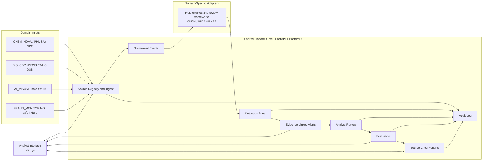

# Architecture

## System Diagram



## Operational Flow

```text
Registered official or approved source
  -> immutable local raw snapshot and SHA-256 hash
  -> analyst-approved field mapping
  -> normalized event table
  -> versioned CBRN-E domain rules
  -> indicators and alerts with linked source evidence
  -> analyst review and threat-level confirmation
  -> notification and response-doctrine audit workflow
  -> evaluation runs linked to rule versions, evidence, and analyst labels
  -> source-cited reports assembled from reviewed alerts
```

## Separation Of Concerns

| Component | Owns |
|---|---|
| Platform core | Sources, ingests, normalized events, alerts, reviews, notifications, audit |
| Domain pack | Taxonomy, detection rules, thresholds, evidence expectations |
| Analyst | Confirmation, disposition, escalation, reporting decision |
| Responsible agency/jurisdiction | Emergency action, formal reporting, incident command, plan activation |

## Initial Services

| Service | Stage 1 capability |
|---|---|
| API | FastAPI routes for core workflow |
| Database | PostgreSQL schema managed through Alembic |
| Ingestion | CSV/JSON upload plus source-field mapping |
| Detection | Versioned CHEM/hazmat rule execution |
| Review | Alert disposition, threat level, notification assessment, plan mapping |
| Interface | Next.js operational dashboard |

## Evaluation Workspace

Stage 5 adds persistent evaluation sets, cases, runs, and case results. Evaluation cases reference
existing normalized events; evaluation runs reference existing detection runs and alert evidence.
This preserves provenance while preventing selected-case results from being presented as new
incident detections.

The workspace supports safe fixture conformance for `AI_MISUSE` and analyst-labeled reviewed
benchmarks for `CBRNE_CHEM`. It compares compatible runs without adding historical alerts into
current operational totals.

## AI Misuse Assessment Boundary

The `AI_MISUSE` pack reuses provenance, alerts, review, evaluation, and audit storage, while
separating safety-review routing from field-incident handling. Its controlled fixtures use
`AI_MISUSE_REVIEW` with `MR0` through `MR3`. API enforcement prevents those records from opening
external notification or response-doctrine actions.

## Biological Monitoring Boundary

`CBRNE_BIO` reuses official-source provenance, normalized events, evidence-linked alerts, and
analyst disposition. `BIO_MONITORING_V0.1` adds bounded WHO Disease Outbreak News and CDC NNDSS
weekly synchronization. WHO records create official-report observations; scorable CDC rows may
create a prior-maximum review indicator. Both rules are capped at `TL1` in this version.

BIO observation alerts do not create notification or response-doctrine records. Public official
reporting and provisional surveillance counts do not establish deliberate release, cause,
attribution, or emergency status.

## Fraud Experiment Boundary

`FRAUD_MONITORING_V0.1` uses a committed synthetic fixture with abstract pattern categories only.
It reuses source, event, alert, evaluation, report, and audit records while adding a fraud rule
adapter and the separate `FRAUD_REVIEW` framework (`FR0` through `FR3`). The fixture contains no
real financial records or personal identifiers, and its outputs do not establish real-world
fraud performance.

Fraud fixture alerts cannot open CBRN-E notification or doctrine actions. A future operational
fraud product would need lawful labeled records, privacy controls, and a separately approved
referral process.

## Reviewed Report Boundary

Stage 7 persists reports assembled from alerts that already have analyst review records. A report
belongs to one domain pack and one rule-set version and stores selected alert IDs, existing
evidence links, rule rationale, source limitations, disposition, notes, and a fixed domain
disclosure. Report generation does not run a rule, revise an alert, contact an outside party, or
write a narrative conclusion.

The API provides report creation, report index/detail retrieval, reviewed-alert eligibility, and
JSON export. The interface adds a report workspace and printable detail view. AI-written
summaries remain excluded pending a separate approval and design decision.

## Growth Path

NOAA, PHMSA, and NRC connectors provide CHEM/hazmat source records after format verification. NRC reports are joined across official workbook sheets by `SEQNOS` and can be compared with PHMSA reports for analyst-reviewed correlation. WHO DON and CDC NNDSS extend monitoring into BIO locally; cross-source BIO correlation remains deferred until condition, place, and time matching can be documented and tested. The controlled fraud experiment now demonstrates reuse of the platform records and workflow with a new rule and review adapter. EXP and dedicated RN classification remain documented expansion decisions rather than implemented alert domains.

The AI Misuse Risk Assessment Module is implemented before BIO expansion as a controlled safety
analysis increment relevant to AI safety investigation. It is not a live model testing system.
